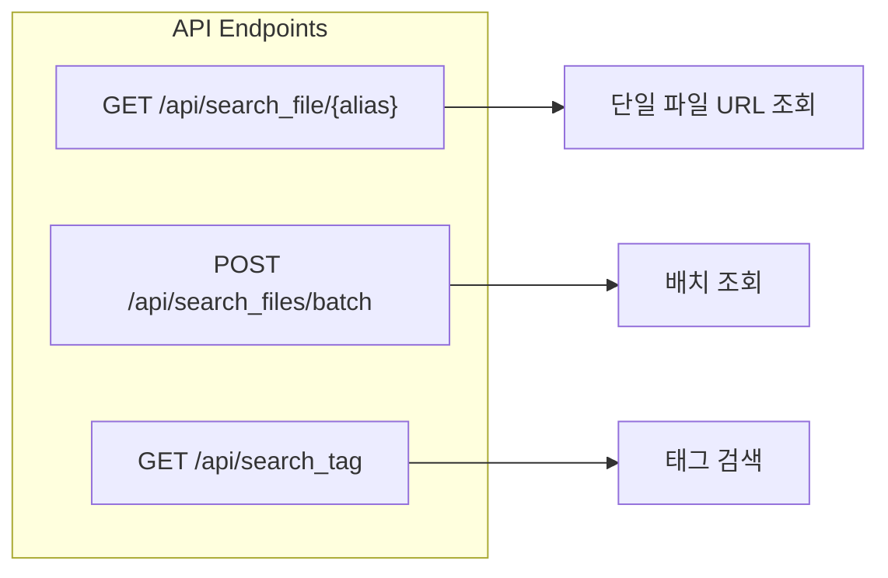

### 메모
nginx 설치
docker pull nginx
docker run -d -p 80:80 nginx

---
### 목표

- 기존 로컬 디렉토리의 딥러닝용 훈련 데이터를 복사 없이 논리적으로 관리
- 다중 호스트에서 고속 네트워크 접근 지원
- 별칭(Alias) 기반의 유연한 데이터셋 버전 관리

### 기본 개념
`Alias_Storage.db`에는
    
    ALIAS TEXT PRIMARY KEY,
    PHYSICAL_FILE_PATH TEXT NOT NULL,
    PROJECT_NAME TEXT,
	CLASH_SET TEXT,
	TAGS TEXT,
	DESCRIPTION TEXT,
	CREATED_AT TIMESTAMP DEFAULT CURRENT_TIMESTAMP

이렇게 칼럼이 있고, 클라이언트는 해당 데이터의 별칭(`ALIAS`)만 알고 있어도 `PHYSICAL_FILE_PATH`와 매핑하여 물리 주소를 알 수 있음

data 폴더에는 실제 파일들이 들어가 있음(예시이며, 다양한 로컬 디렉터리 경로에 있음. `Alias_Storage.db`가 기준임)

클라이언트가 alias이름으로 요청하면 fastapi앱은 alias에 해당하는 물리 주소를 찾고 nginx가 클라이언트에게 이미지 파일을 빠르게 서빙함

### API 앤드포인트



### FastAPI 응답 형식 예시

```json
{
  "alias": "ShowCase_YEP6_1_9_9.png",
  "url": "http://nginx-server/raw/path/to/file.jpg"
}
```

### Docker 컨테이너는 별도로 구성
- Nginx 컨테이너 : 80:80 -> .conf 설정은 별도로 관리
- FastAPI 컨테이너(dataset-server) : 9006:9006
- SQLite : 로컬 파일
- /data : 당연히 로컬 파일
- docker-compose 안에서 관리

